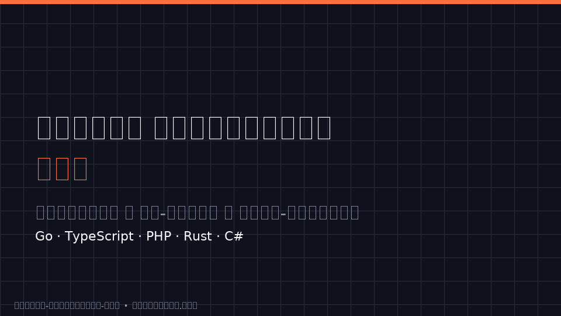
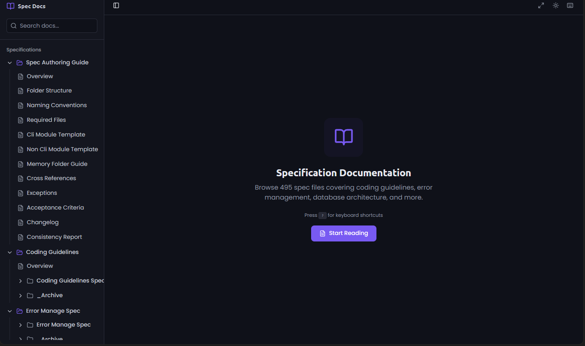

<p align="center">
  <a href="https://github.com/alimtvnetwork/coding-guidelines-v15">
    
  </a>
</p>

<h1 align="center">Coding Guidelines v15</h1>

<p align="center">
  <strong>Battle-tested coding standards, error handling, and spec architecture<br/>
  for <em>Go, TypeScript, PHP, Rust, and C#</em> — engineered for both human developers and AI code generators.</strong>
</p>

<p align="center">
  <!-- STAMP:BADGES -->[](https://github.com/alimtvnetwork/coding-guidelines-v15/releases) [](spec/) [](spec/) [](version.json) [](LICENSE) [](llm.md) [](version.json)<!-- /STAMP:BADGES -->
</p>

<p align="center">
  <!-- STAMP:PLATFORM_BADGES -->[](spec/02-coding-guidelines/) [](#-bundle-installers) [](bundles.json) [-F59E0B?style=flat-square)](public/health-score.json) [](spec/17-consolidated-guidelines/29-blind-ai-audit-v3.md) [](#-contributing) [](https://lovable.dev) [](https://github.com/alimtvnetwork/coding-guidelines-v15/stargazers) [](https://github.com/alimtvnetwork/coding-guidelines-v15/issues)<!-- /STAMP:PLATFORM_BADGES -->
</p>

<p align="center">
  <strong>By <a href="https://alimkarim.com/">Md. Alim Ul Karim</a></strong> — Chief Software Engineer, <a href="https://riseup-asia.com/">Riseup Asia LLC</a><br/>
  <a href="https://www.linkedin.com/in/alimkarim">LinkedIn</a> ·
  <a href="https://stackoverflow.com/users/513511/md-alim-ul-karim">Stack Overflow</a> ·
  <a href="https://github.com/alimtvnetwork">GitHub</a> ·
  <a href="docs/author.md">Full bio</a>
</p>

<p align="center">
  <em>Stats:</em> <!-- STAMP:FILES -->610<!-- /STAMP:FILES --> spec files · <!-- STAMP:FOLDERS -->22<!-- /STAMP:FOLDERS --> top-level folders · <!-- STAMP:LINES -->131,442<!-- /STAMP:LINES --> lines · v<!-- STAMP:VERSION -->3.59.0<!-- /STAMP:VERSION --> · updated <!-- STAMP:UPDATED -->2026-04-22<!-- /STAMP:UPDATED -->
</p>

---

## What is this? Who is it for?

A production-grade specification system you can drop into any codebase to enforce consistent naming, structured error handling, zero-nesting rules, and AI-friendly documentation — without inventing your own conventions. Pick the bundle that fits, run a one-liner, get the spec folders.

### 30-second tour — pick your role

| If you are a… | Start here |
|---|---|
| 🧑‍💻 **Developer adopting the rules** | [`docs/principles.md`](docs/principles.md) → pick a [bundle](#-bundle-installers) |
| ✍️ **Spec author** | [`docs/architecture.md`](docs/architecture.md) → [`spec/01-spec-authoring-guide/`](spec/01-spec-authoring-guide/00-overview.md) |
| 🐘 **WordPress plugin dev** | [`wp` bundle](#-bundle-installers) → [`spec/18-wp-plugin-how-to/`](spec/18-wp-plugin-how-to/00-overview.md) |
| 🤖 **AI agent / LLM** | [`## For AI Agents`](#-for-ai-agents) below — canonical entry points |

<p align="center">
  
</p>

<p align="center">
  <em>(Static fallback for PDF/print: <a href="public/images/coding-guidelines-walkthrough-poster.png">coding-guidelines-walkthrough-poster.png</a>)</em>
</p>

*Animated walkthrough — the 5 core principles, a before/after refactor, and the 7 install bundles. Loops automatically.*

---

## 🤖 For AI Agents

If you are an LLM or autonomous coding agent, these are your **canonical entry points**:

| File | Purpose |
|---|---|
| [`llm.md`](llm.md) | Repository map + priority files for context-window optimization |
| [`bundles.json`](bundles.json) | Machine-readable bundle catalogue (validated against `bundles.schema.json`) |
| [`version.json`](version.json) | Live counts, per-folder version, AI-confidence ratings |
| [`spec/02-coding-guidelines/06-ai-optimization/04-condensed-master-guidelines.md`](spec/02-coding-guidelines/06-ai-optimization/04-condensed-master-guidelines.md) | Sub-200-line distillation — load this first |
| [`spec/02-coding-guidelines/06-ai-optimization/01-anti-hallucination-rules.md`](spec/02-coding-guidelines/06-ai-optimization/01-anti-hallucination-rules.md) | 34 explicit ❌/✅ rules to prevent common AI mistakes |
| [`spec/17-consolidated-guidelines/00-overview.md`](spec/17-consolidated-guidelines/00-overview.md) | Master consolidated reference index |
| [`.lovable/memory/index.md`](.lovable/memory/index.md) | Project memory — naming, DB schema, code-red rules |
| [`.lovable/prompts/00-index.md`](.lovable/prompts/00-index.md) | Reusable prompt workflows (e.g. `blind audit` trigger) |

**To answer "which bundle do I need?"** — fetch `bundles.json`, match the user's intent to a bundle `name`, then return the matching one-liner from the [Bundle Installers](#-bundle-installers) table.

---

## 📦 Bundle Installers

Each bundle is an **independent one-line installer** that pulls only the spec folders it needs. Use these instead of the full repo install when you want a focused subset.

<p align="center">
  
</p>

*One line. Any bundle. Anywhere — no clone required.*

| Bundle | What it installs | Bash one-liner | PowerShell one-liner |
|---|---|---|---|
| **error-manage** | `spec/01-spec-authoring-guide/` + `spec/03-error-manage/` | `curl -fsSL https://raw.githubusercontent.com/alimtvnetwork/coding-guidelines-v15/main/error-manage-install.sh \| bash` | `irm https://raw.githubusercontent.com/alimtvnetwork/coding-guidelines-v15/main/error-manage-install.ps1 \| iex` |
| **splitdb** | `04-database-conventions/` + `05-split-db-architecture/` + `06-seedable-config-architecture/` | `curl -fsSL https://raw.githubusercontent.com/alimtvnetwork/coding-guidelines-v15/main/splitdb-install.sh \| bash` | `irm https://raw.githubusercontent.com/alimtvnetwork/coding-guidelines-v15/main/splitdb-install.ps1 \| iex` |
| **slides** | `spec-slides/` decks + `slides-app/` Vite presentation app | `curl -fsSL https://raw.githubusercontent.com/alimtvnetwork/coding-guidelines-v15/main/slides-install.sh \| bash` | `irm https://raw.githubusercontent.com/alimtvnetwork/coding-guidelines-v15/main/slides-install.ps1 \| iex` |
| **linters** | `linters/` (golangci-lint, phpcs, sonarqube, stylecop) + `linters-cicd/` runner pack | `curl -fsSL https://raw.githubusercontent.com/alimtvnetwork/coding-guidelines-v15/main/linters-install.sh \| bash` | `irm https://raw.githubusercontent.com/alimtvnetwork/coding-guidelines-v15/main/linters-install.ps1 \| iex` |
| **cli** | `spec/11`–`spec/16` (PowerShell, CI/CD, generic CLI, update, distribution, release) | `curl -fsSL https://raw.githubusercontent.com/alimtvnetwork/coding-guidelines-v15/main/cli-install.sh \| bash` | `irm https://raw.githubusercontent.com/alimtvnetwork/coding-guidelines-v15/main/cli-install.ps1 \| iex` |
| **wp** | `spec/18-wp-plugin-how-to/` (WordPress plugin Gold-Standard spec) | `curl -fsSL https://raw.githubusercontent.com/alimtvnetwork/coding-guidelines-v15/main/wp-install.sh \| bash` | `irm https://raw.githubusercontent.com/alimtvnetwork/coding-guidelines-v15/main/wp-install.ps1 \| iex` |
| **consolidated** | `01-spec-authoring-guide/` + `03-error-manage/` + `17-consolidated-guidelines/` | `curl -fsSL https://raw.githubusercontent.com/alimtvnetwork/coding-guidelines-v15/main/consolidated-install.sh \| bash` | `irm https://raw.githubusercontent.com/alimtvnetwork/coding-guidelines-v15/main/consolidated-install.ps1 \| iex` |

All bundles share these traits:

- **Zero dependencies on each other** — install any combination, in any order.
- **Idempotent** — re-running overwrites in place; nothing gets duplicated.
- **Temp-clean** — downloads to `/tmp` (or `%TEMP%`), copies the bundle's folders, then deletes the temp dir even on failure.
- **Versionable** — every bundle ships in a versioned GitHub Release archive (e.g. `coding-guidelines-error-manage-v1.4.0.zip`) with `checksums.txt`.
- **Manifest-backed** — defined in [`bundles.json`](bundles.json) at the repo root.

### Pick a bundle by goal

| If you want to… | Install |
|---|---|
| Adopt the error-management architecture in a new project | `error-manage` |
| Set up a multi-database (Root / App / Session) backend | `splitdb` |
| Teach a team the guidelines via slides | `slides` |
| Add the linter ruleset + CI runners to a polyglot repo | `linters` |
| Build a cross-platform CLI tool with self-update | `cli` |
| Author a WordPress plugin to the Gold-Standard spec | `wp` |
| Get the master consolidated reference (everything in one place) | `consolidated` |

### Verify your install

Each release publishes a `checksums.txt` next to the bundle archive. Verify before extracting:

```bash
# Linux / macOS
curl -fsSLO https://github.com/alimtvnetwork/coding-guidelines-v15/releases/download/v3.55.0/checksums.txt
sha256sum -c checksums.txt --ignore-missing
```

```powershell
# Windows PowerShell
Invoke-WebRequest https://github.com/alimtvnetwork/coding-guidelines-v15/releases/download/v3.55.0/checksums.txt -OutFile checksums.txt
Get-FileHash coding-guidelines-error-manage-v3.55.0.zip -Algorithm SHA256
# Compare against the matching line in checksums.txt
```

> **Windows SmartScreen note:** if PowerShell flags the `irm | iex` pattern, run `Unblock-File .\install.ps1` after a manual download, or use `-ExecutionPolicy Bypass` for a single session. The release scripts are unsigned today — script signing is on the roadmap.

### Uninstall

The installers only **add** files — they do not track an uninstall manifest. To remove a bundle, delete the folders it created. For example, the `error-manage` bundle:

```bash
rm -rf spec/01-spec-authoring-guide spec/03-error-manage
```

```powershell
Remove-Item -Recurse -Force spec\01-spec-authoring-guide, spec\03-error-manage
```

The exact folder list per bundle is in [`bundles.json`](bundles.json) under each bundle's `folders[].dest` field. A scripted `uninstall.sh` / `uninstall.ps1` is on the roadmap (Phase B follow-up).

---

## 🛠️ Full-Repo Install Scripts

When you want **everything** (specs + linters + scripts), use the generic installers. They support remote one-liners and local re-runs with overrides.

### Remote one-liner (no clone required)

```bash
curl -fsSL https://raw.githubusercontent.com/alimtvnetwork/coding-guidelines-v15/main/install.sh | bash
```

```powershell
irm https://raw.githubusercontent.com/alimtvnetwork/coding-guidelines-v15/main/install.ps1 | iex
```

Skip the latest-version probe (use this exact installer):

```bash
curl -fsSL https://raw.githubusercontent.com/alimtvnetwork/coding-guidelines-v15/main/install.sh | bash -s -- -n
```

```powershell
& ([scriptblock]::Create((irm https://raw.githubusercontent.com/alimtvnetwork/coding-guidelines-v15/main/install.ps1))) -n
```

> **What does `-n` / `--no-latest` do?** By default the installer probes 20 candidate "next" repository versions in parallel (e.g. `coding-guidelines-v15` … `coding-guidelines-v34`) and hands off to the newest one it finds. Pass `-n` to skip that probe entirely.

### Local script (after cloning)

```bash
chmod +x install.sh && ./install.sh
```

```powershell
.\install.ps1
```

### Power-user flags

Both `install.sh` and `install.ps1` support the same set of flags:

| Bash | PowerShell | What it does |
|---|---|---|
| `--repo owner/repo` | `-Repo owner/repo` | Override source repository |
| `--branch main` | `-Branch main` | Override branch (ignored when version is set) |
| `--version vX.Y.Z` | `-Version vX.Y.Z` | Install a specific release tag |
| `--folders a,b,c` | `-Folders a,b,c` | Comma/array list of folders |
| `--dest /path` | `-Dest C:\path` | Install destination (default: cwd) |
| `--config file.json` | `-ConfigFile file.json` | Use a custom config file |
| `--prompt` | `-Prompt` | Ask before each overwrite |
| `--force` | `-Force` | Overwrite all without prompting |
| `--dry-run` | `-DryRun` | Print what would change; write nothing |
| `--list-versions` | `-ListVersions` | List available release tags and exit |
| `--list-folders` | `-ListFolders` | List top-level folders and exit |
| `--no-probe`, `--no-latest`, `-n` | `-NoProbe`, `-NoLatest`, `-n` | Skip the latest-version auto-probe |

`--prompt` and `--force` are mutually exclusive. The scripts also read `install-config.json` for default `repo` / `branch` / `folders`.

---

## 📚 Documentation

The README intentionally stays under 400 lines. Deep-dives live in `docs/`:

| Doc | What's inside |
|---|---|
| [`docs/principles.md`](docs/principles.md) | 9 core principles · 10 CODE RED rules · cross-language rule index · AI optimization suite |
| [`docs/architecture.md`](docs/architecture.md) | Spec authoring conventions · folder structure · architecture decisions · error management summary |
| [`docs/author.md`](docs/author.md) | Author bio · Riseup Asia LLC · AI assessments · FAQ · design philosophy |

Plus the live spec tree:

- [`spec/`](spec/) — all 22 top-level folders, browseable.
- [`spec/health-dashboard.md`](spec/health-dashboard.md) — global self-assessment.
- [`spec/17-consolidated-guidelines/00-overview.md`](spec/17-consolidated-guidelines/00-overview.md) — master consolidated index.

<p align="center">
  
</p>

*The built-in Spec Documentation Viewer — browse, search, and read all spec files with syntax highlighting, keyboard navigation, and fullscreen mode.*

---

## 🔄 What's New

See [`changelog.md`](changelog.md) for the full version history. Recent highlights:

- **v3.55.0** — Bundle installer matrix + animated GIFs in README; 7 standalone bundles registered in `bundles.json`.
- **v3.54.0** — Reusable "blind-AI audit" workflow registered as a memory-triggered prompt (`blind audit` / `audit gap`).
- **v3.51.0** — Phase 6B: extracted `15-distribution-and-runner/` into a standalone module.

---

## 🤝 Contributing

### Adding a new spec

1. Choose the correct parent folder (numeric prefix decides position).
2. Use the [Non-CLI Module Template](spec/01-spec-authoring-guide/05-non-cli-module-template.md).
3. Include required files: `00-overview.md`, `99-consistency-report.md`.
4. Add metadata: Version, AI Confidence, Ambiguity, Keywords, Scoring table.
5. Use file-relative cross-references with `.md` extension.
6. Update the parent `00-overview.md` to reference the new file.

### Modifying an existing rule

1. Find the **canonical source** — never duplicate.
2. Bump the version number.
3. Add a changelog entry in the nearest `98-changelog.md`.
4. Run `npm run sync` to refresh `version.json`, `specTree.json`, and the README stamps.

### Running health checks

```bash
python3 linter-scripts/check-links.py        # broken cross-references
grep -rn "Score" spec/*/99-consistency-report.md   # per-folder scores
npm run sync                                   # version + tree + README stamps
```

---

*This README is auto-stamped by [`scripts/sync-readme-stats.mjs`](scripts/sync-readme-stats.mjs). The numbers above are pulled from [`version.json`](version.json) on every `npm run sync`. Hand-editing the stamped values is safe but will be overwritten on the next sync.*
