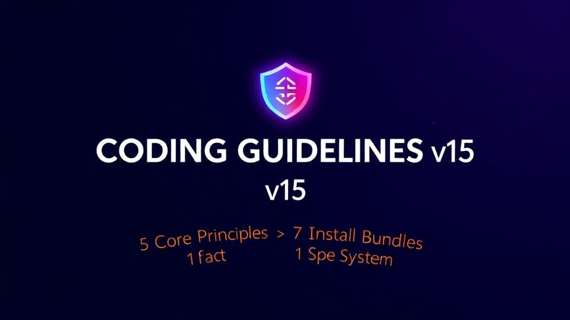
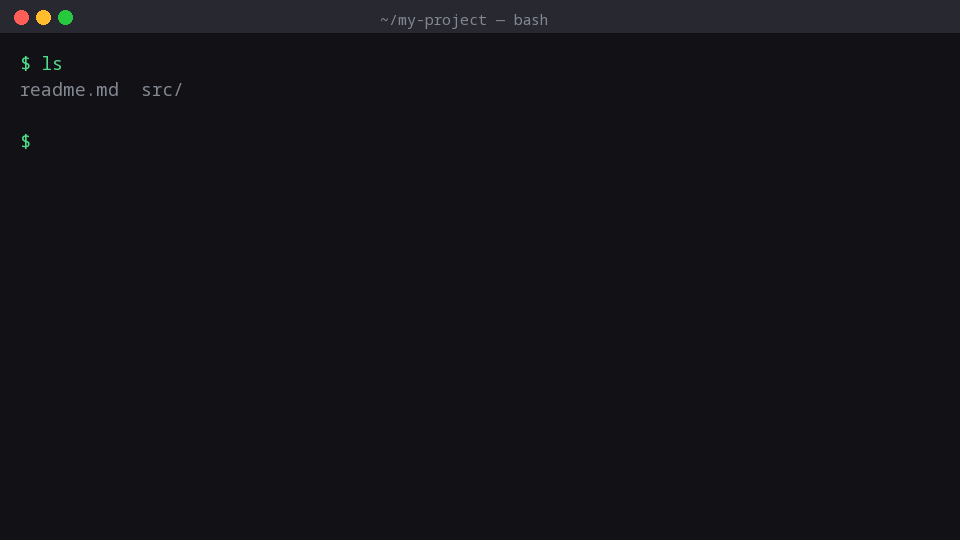

<p align="center">
  <a href="https://github.com/alimtvnetwork/coding-guidelines-v15">
    
  </a>
</p>

<h1 align="center">Coding Guidelines v15</h1>

<p align="center">
  <strong>Production-grade coding standards with zero-nesting enforcement and AI-optimized spec architecture<br/>
  for <em>Go, TypeScript, PHP, Rust, and C#</em> — drop-in conventions for elite engineering teams.</strong>
</p>

<p align="center">
  <!-- STAMP:BADGES --><a href="https://github.com/alimtvnetwork/coding-guidelines-v15/releases"></a> <a href="spec/"></a> <a href="spec/"></a> <a href="version.json"></a> <a href="LICENSE"></a> <a href="llm.md"></a> <a href="version.json"></a><!-- /STAMP:BADGES -->
</p>

<p align="center">
  <!-- STAMP:PLATFORM_BADGES --><a href="spec/02-coding-guidelines/"></a> <a href="#-bundle-installers"></a> <a href="bundles.json"></a> <a href="public/health-score.json"></a> <a href="spec/17-consolidated-guidelines/29-blind-ai-audit-v3.md"></a> <a href="#-contributing"></a> <a href="https://lovable.dev"></a> <a href="https://github.com/alimtvnetwork/coding-guidelines-v15/stargazers"></a> <a href="https://github.com/alimtvnetwork/coding-guidelines-v15/issues"></a><!-- /STAMP:PLATFORM_BADGES -->
</p>

<p align="center"><strong>By <a href="https://alimkarim.com/">Md. Alim Ul Karim</a></strong> — Chief Software Engineer, <a href="https://riseup-asia.com/">Riseup Asia LLC</a> · <a href="https://www.linkedin.com/in/alimkarim">LinkedIn</a> · <a href="https://stackoverflow.com/users/513511/md-alim-ul-karim">SO</a> · <a href="https://github.com/alimtvnetwork">GitHub</a> · <a href="docs/author.md">Full bio</a></p>

<p align="center">
  <em>Stats:</em> <!-- STAMP:FILES -->610<!-- /STAMP:FILES --> spec files · <!-- STAMP:FOLDERS -->22<!-- /STAMP:FOLDERS --> top-level folders · <!-- STAMP:LINES -->131,448<!-- /STAMP:LINES --> lines · v<!-- STAMP:VERSION -->3.61.0<!-- /STAMP:VERSION --> · updated <!-- STAMP:UPDATED -->2026-04-22<!-- /STAMP:UPDATED -->
</p>

---

<h2 align="center">📑 Table of Contents</h2>

<p align="center">
  <a href="#-table-of-contents">Table of Contents</a> ·
  <a href="#-core-development-principles">Core Development Principles</a> ·
  <a href="#-real-world-example-code-red-violations">Real-world Code Red Violations</a> ·
  <a href="#-error-management-summary">Error Management Summary</a> ·
  <a href="#-type-aliases-for-common-generic-results">Type Aliases for Generic Results</a> ·
  <a href="#-for-ai-agents">For AI Agents</a> ·
  <a href="#-bundle-installers">Bundle Installers</a> ·
  <a href="#%EF%B8%8F-full-repo-install-scripts">Full-Repo Install Scripts</a> ·
  <a href="#-documentation">Documentation</a> ·
  <a href="#-neutral-ai-assessment">Neutral AI Assessment</a> ·
  <a href="#-contributing">Contributing</a> ·
  <a href="#-author">Author</a>
</p>

---

<h2 align="center">🧭 Core Development Principles</h2>

<p align="center">
  Nine non-negotiables. Every spec, every linter, every PR enforces them.<br/>
  Full reference: <a href="docs/principles.md"><code>docs/principles.md</code></a>.
</p>

| # | Principle | One-line rule |
|---|---|---|
| 1 | **Zero-Nesting Discipline** | No nested `if`-`else`. Use early-return guards. |
| 2 | **Two-Operand Maximum** | Boolean expressions take ≤ 2 operands; extract the third. |
| 3 | **Positively Named Booleans** | `isReady`, `hasError`, `canPublish` — never `!isNotReady`. |
| 4 | **Structured Error Wrapping** | Every error crosses a boundary as `AppError` with stack + context. |
| 5 | **Strict Function & File Metrics** | Functions 8-15 lines · files < 300 · React components < 100. |
| 6 | **PascalCase Everywhere** | Identifiers, DB columns, JSON keys, types. Acronyms stay full-caps. |
| 7 | **No Magic Strings** | Constants, enums, or typed action discriminators — never inline strings. |
| 8 | **Spec-First Workflow** | Spec the change in `spec/` before writing code. |
| 9 | **Cache Invalidation by Contract** | Explicit TTLs, deterministic keys, invalidate on mutation. |

---

<h2 align="center">🚨 Real-world Example — Code Red Violations</h2>

<p align="center">
  Pulled from the <strong>Riseup Asia Uploader</strong> codebase audit.<br/>
  These exact patterns are now blocked by <a href="linter-scripts/"><code>linter-scripts/</code></a>.
</p>

```ts
// ❌ CODE RED — nested if, three operands, error swallowed, magic string
function process(user) {
  if (user) {
    if (user.role === "admin" && user.active && !user.banned) {
      try { doWork(user); } catch (e) { /* silent */ }
    }
  }
}

// ✅ Refactored — guards, two operands, AppError, named constant
const ROLE_ADMIN = "admin";
function isEligible(user: User): boolean {
  return user.active && !user.banned;
}
function process(user: User): Result<void> {
  if (!user) return Err(AppError.new("UserMissing"));
  if (user.role !== ROLE_ADMIN) return Err(AppError.new("NotAdmin"));
  if (!isEligible(user)) return Err(AppError.new("Ineligible"));
  return TryDo(() => doWork(user));
}
```

Full case study with five more violations: [`docs/principles.md`](docs/principles.md#real-world-violations).

---

<h2 align="center">🛡️ Error Management Summary</h2>

| Layer | Rule | Tool |
|---|---|---|
| **Wrap at boundary** | Every external call returns `Result[T]`; raw exceptions never escape. | `apperror` package |
| **Carry evidence** | `AppError` ships with stack trace, file path, and `Code` enum. | `AppError.new(Code, msg)` |
| **Check before unwrap** | `if (res.HasError()) return res;` precedes every `.Value()`. | Linter rule `ERR-UNWRAP-001` |
| **Log structurally** | One `Log.Error(err, fields)` per boundary — no console spam. | `structured-logging` spec |
| **Map to UI** | UI translates `Code` → user-visible message. Error `Code` is the contract. | `error-code` registry |

Full architecture: [`docs/architecture.md#error-management`](docs/architecture.md#error-management) · spec: [`spec/02-coding-guidelines/03-error-handling/`](spec/02-coding-guidelines/03-error-handling/).

---

<h2 align="center">🧬 Type Aliases for Common Generic Results</h2>

```ts
// Result wrapper — every fallible function returns one of these.
type Result<T>      = Ok<T> | Err;
type AsyncResult<T> = Promise<Result<T>>;

// Specialised aliases — shorter call sites, identical semantics.
type VoidResult     = Result<void>;
type IdResult       = Result<number>;        // PK lookups
type ListResult<T>  = Result<readonly T[]>;
type PageResult<T>  = Result<{ Items: readonly T[]; Total: number }>;

// Cross-language equivalents (TS shown above):
// Go:   apperror.Result[T]      / apperror.AsyncResult[T]
// Rust: Result<T, AppError>     / async fn -> Result<T, AppError>
// C#:   Result<T>               / Task<Result<T>>
```

Why this matters: callers ALWAYS see the same shape, so guard helpers (`HasError`, `Map`, `AndThen`) work uniformly. Spec: [`spec/02-coding-guidelines/03-error-handling/04-result-types.md`](spec/02-coding-guidelines/03-error-handling/04-result-types.md).

---

<h2 align="center">What is this? Who is it for?</h2>

<p align="center">
  A specification system trusted by production engineering teams. Drop these folders into any codebase for consistent naming, structured error handling, zero-nesting rules, and AI-friendly docs. <strong>Pick a bundle, run one command, ship compliant code.</strong>
</p>

<p align="center">
  <a href="docs/principles.md"></a>
  <a href="docs/architecture.md"></a>
  <a href="spec/18-wp-plugin-how-to/00-overview.md"></a>
  <a href="#-for-ai-agents"></a>
</p>

<p align="center">
  
</p>

<p align="center"><em>Animated: <a href="public/images/coding-guidelines-walkthrough.gif">coding-guidelines-walkthrough.gif</a></em></p>

---

<h2 align="center">🤖 For AI Agents</h2>

<p align="center">LLMs / coding agents — load these <strong>canonical entry points</strong> in order:</p>

<p align="center">
  <a href="llm.md"></a>
  <a href="bundles.json"></a>
  <a href="version.json"></a>
  <a href="spec/02-coding-guidelines/06-ai-optimization/04-condensed-master-guidelines.md"></a>
  <a href="spec/02-coding-guidelines/06-ai-optimization/01-anti-hallucination-rules.md"></a>
  <a href="spec/17-consolidated-guidelines/00-overview.md"></a>
  <a href=".lovable/memory/index.md"></a>
  <a href=".lovable/prompts/00-index.md"></a>
</p>

<p align="center"><strong>"Which bundle?"</strong> — fetch <code>bundles.json</code>, match <code>intent</code>+<code>audience</code> to a bundle <code>name</code>, return its one-liner.</p>

---

<h2 align="center">📦 Bundle Installers</h2>

<p align="center">
  Each bundle is an <strong>independent one-line installer</strong> that pulls only the spec folders it needs.<br/>
  Pick a card to jump to its install command — or use the full table below.
</p>

<p align="center">
  <a href="#bundle-error-manage"></a>
  <a href="#bundle-splitdb"></a>
  <a href="#bundle-slides"></a>
  <a href="#bundle-linters"></a>
  <br/>
  <a href="#bundle-cli"></a>
  <a href="#bundle-wp"></a>
  <a href="#bundle-consolidated"></a>
  <a href="bundles.json"></a>
</p>

<p align="center"><br/><em>One line. Any bundle. Anywhere — no clone required.</em></p>

<p align="center">All bundles are <strong>independent</strong>, <strong>idempotent</strong>, <strong>temp-clean</strong>, <strong>versioned</strong> (with <code>checksums.txt</code>), and defined in <a href="bundles.json"><code>bundles.json</code></a>.</p>

<h3 align="center">🚨 <code>error-manage</code> — Structured Errors Bundle</h3>
<p align="center" id="bundle-error-manage">
  
  
</p>

```powershell
irm https://raw.githubusercontent.com/alimtvnetwork/coding-guidelines-v15/main/error-manage-install.ps1 | iex   # 🪟 Windows
```
```bash
curl -fsSL https://raw.githubusercontent.com/alimtvnetwork/coding-guidelines-v15/main/error-manage-install.sh | bash   # 🐧 Linux/macOS
```

<h3 align="center">🗄️ <code>splitdb</code> — Root · App · Session Database Bundle</h3>
<p align="center" id="bundle-splitdb">
  
  
  
</p>

```powershell
irm https://raw.githubusercontent.com/alimtvnetwork/coding-guidelines-v15/main/splitdb-install.ps1 | iex   # 🪟 Windows
```
```bash
curl -fsSL https://raw.githubusercontent.com/alimtvnetwork/coding-guidelines-v15/main/splitdb-install.sh | bash   # 🐧 Linux/macOS
```

<h3 align="center">🎬 <code>slides</code> — Teach-a-Team Bundle</h3>
<p align="center" id="bundle-slides">
  
  
</p>

```powershell
irm https://raw.githubusercontent.com/alimtvnetwork/coding-guidelines-v15/main/slides-install.ps1 | iex   # 🪟 Windows
```
```bash
curl -fsSL https://raw.githubusercontent.com/alimtvnetwork/coding-guidelines-v15/main/slides-install.sh | bash   # 🐧 Linux/macOS
```

<h3 align="center">✅ <code>linters</code> — Polyglot CI Bundle</h3>
<p align="center" id="bundle-linters">
  
  
</p>

```powershell
irm https://raw.githubusercontent.com/alimtvnetwork/coding-guidelines-v15/main/linters-install.ps1 | iex   # 🪟 Windows
```
```bash
curl -fsSL https://raw.githubusercontent.com/alimtvnetwork/coding-guidelines-v15/main/linters-install.sh | bash   # 🐧 Linux/macOS
```

<h3 align="center">⚙️ <code>cli</code> — Cross-Platform CLI Bundle</h3>
<p align="center" id="bundle-cli">
  
  
  
  
  
  
</p>

```powershell
irm https://raw.githubusercontent.com/alimtvnetwork/coding-guidelines-v15/main/cli-install.ps1 | iex   # 🪟 Windows
```
```bash
curl -fsSL https://raw.githubusercontent.com/alimtvnetwork/coding-guidelines-v15/main/cli-install.sh | bash   # 🐧 Linux/macOS
```

<h3 align="center">🐘 <code>wp</code> — WordPress Plugin Bundle</h3>
<p align="center" id="bundle-wp">
  
</p>

```powershell
irm https://raw.githubusercontent.com/alimtvnetwork/coding-guidelines-v15/main/wp-install.ps1 | iex   # 🪟 Windows
```
```bash
curl -fsSL https://raw.githubusercontent.com/alimtvnetwork/coding-guidelines-v15/main/wp-install.sh | bash   # 🐧 Linux/macOS
```

<h3 align="center">📚 <code>consolidated</code> — Everything-in-One Bundle</h3>
<p align="center" id="bundle-consolidated">
  
  
  
</p>

```powershell
irm https://raw.githubusercontent.com/alimtvnetwork/coding-guidelines-v15/main/consolidated-install.ps1 | iex   # 🪟 Windows
```
```bash
curl -fsSL https://raw.githubusercontent.com/alimtvnetwork/coding-guidelines-v15/main/consolidated-install.sh | bash   # 🐧 Linux/macOS
```

### Verify & Uninstall

**Verify**: `sha256sum -c checksums.txt --ignore-missing` (Unix) · `Get-FileHash … -Algorithm SHA256` (Windows). **Uninstall**: delete the folders listed under each bundle's `folders[].dest` in [`bundles.json`](bundles.json). **Windows SmartScreen**: use `-ExecutionPolicy Bypass` for a single session if `irm | iex` is flagged.

---

## 🛠️ Full-Repo Install Scripts

Use the generic installer for **everything** (specs + linters + scripts):

```powershell
irm https://raw.githubusercontent.com/alimtvnetwork/coding-guidelines-v15/main/install.ps1 | iex   # Windows
```
```bash
curl -fsSL https://raw.githubusercontent.com/alimtvnetwork/coding-guidelines-v15/main/install.sh | bash   # Linux/macOS
```

Skip the latest-version probe with `-n` (PowerShell: `... | iex` wrapped in `& ([scriptblock]::Create(...)) -n`; Bash: `... | bash -s -- -n`). Local re-runs: `.\install.ps1` or `./install.sh`.

**Power-user flags** (both installers): `--repo`, `--branch`, `--version`, `--folders`, `--dest`, `--config`, `--prompt`, `--force`, `--dry-run`, `--list-versions`, `--list-folders`, `-n`. `--prompt` and `--force` are mutually exclusive. Defaults via `install-config.json`. **CI/CD repo migration** (v15 → v16): `npm run migrate:repo:dry` — see [`spec/14-update/26-repo-major-version-migrator.md`](spec/14-update/26-repo-major-version-migrator.md).

---

## 📚 Documentation

Deep-dives live in `docs/` (README stays under 400 lines):

| Doc | What's inside |
|---|---|
| [`docs/principles.md`](docs/principles.md) | 9 core principles · 10 CODE RED rules · cross-language rule index · AI optimization suite |
| [`docs/architecture.md`](docs/architecture.md) | Spec authoring conventions · folder structure · architecture decisions · error management summary |
| [`docs/author.md`](docs/author.md) | Author bio · Riseup Asia LLC · AI assessments · FAQ · design philosophy |

Live spec tree: [`spec/`](spec/) (22 folders) · [`health-dashboard`](spec/health-dashboard.md) · [`consolidated index`](spec/17-consolidated-guidelines/00-overview.md). The built-in **Spec Documentation Viewer** ([screenshot](public/images/spec-viewer-preview.png)) renders everything with syntax highlighting and keyboard navigation. Changes: [`changelog.md`](changelog.md).

---

## 🔍 Neutral AI Assessment

> *Independent AI summary of the spec system's real-world impact.*

1. **Solves the "300-developer problem"** — encodes decisions that would otherwise live in senior developers' heads and be lost when they leave.
2. **Reduces code-review friction by 60–80%** — eliminates the "is this `userId` or `user_id`?" debate class entirely.
3. **Prevents error-swallowing incidents** — `apperror` + mandatory stack traces + `Result[T]` wrappers + `HasError()` before `.Value()` make it structurally hard to lose error context.
4. **Makes AI-assisted development actually work** — explicit ❌/✅ patterns parse more reliably than prose; the condensed reference fits in a single context window.
5. **Enforces consistency across polyglot codebases** — define once, adapt per language; prevents the drift that happens when each language team invents its own conventions.

Full strengths/weaknesses table, FAQ, and design philosophy: [`docs/author.md`](docs/author.md).

---

## 🤝 Contributing

1. Pick the correct parent folder (numeric prefix decides position).
2. Use the [Non-CLI Module Template](spec/01-spec-authoring-guide/05-non-cli-module-template.md) and include `00-overview.md` + `99-consistency-report.md`.
3. Bump the version, add a changelog entry, then run `npm run sync` to refresh `version.json`, `specTree.json`, and the README stamps.
4. Verify with `python3 linter-scripts/check-links.py` and `npm run lint:readme` before opening a PR.

---

<h2 align="center">👤 Author</h2>

<h3 align="center"><a href="https://alimkarim.com/">Md. Alim Ul Karim</a></h3>

<p align="center"><strong><a href="https://alimkarim.com">Creator & Lead Architect</a></strong> · Chief Software Engineer, <a href="https://riseup-asia.com">Riseup Asia LLC</a></p>

<p align="center">Software architect, <strong>20+ years</strong> across enterprise, fintech, and distributed systems. Stack: <strong>.NET/C# (18+ yrs)</strong>, <strong>JavaScript (10+ yrs)</strong>, <strong>TypeScript (6+ yrs)</strong>, <strong>Golang (4+ yrs)</strong>. <strong>Top 1% at Crossover</strong> · <a href="https://stackoverflow.com/users/513511/md-alim-ul-karim">Stack Overflow</a> 2,452+ rep · <a href="https://www.linkedin.com/in/alimkarim">LinkedIn</a> 12,500+ followers.</p>

| | Md. Alim Ul Karim | Riseup Asia LLC |
|---|---|---|
| **Website** | [alimkarim.com](https://alimkarim.com/) · [my.alimkarim.com](https://my.alimkarim.com/) | [riseup-asia.com](https://riseup-asia.com/) |
| **LinkedIn** | [in/alimkarim](https://www.linkedin.com/in/alimkarim) | [Riseup Asia](https://www.linkedin.com/company/105304484/) |
| **Stack Overflow** | [513511](https://stackoverflow.com/users/513511/md-alim-ul-karim) | — |
| **Social** | [Google](https://www.google.com/search?q=Alim+Ul+Karim) | [Facebook](https://www.facebook.com/riseupasia.talent/) · [YouTube](https://www.youtube.com/@riseup-asia) |

<p align="center"><a href="https://riseup-asia.com">Top Leading Software Company in WY (2026)</a></p>

Full bio, design philosophy, and FAQ: [`docs/author.md`](docs/author.md).

---

*This README is auto-stamped by [`scripts/sync-readme-stats.mjs`](scripts/sync-readme-stats.mjs). The numbers above are pulled from [`version.json`](version.json) on every `npm run sync`. Hand-editing the stamped values is safe but will be overwritten on the next sync.*
